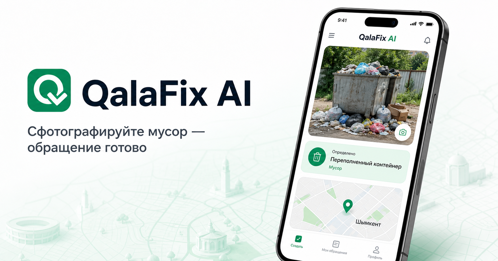
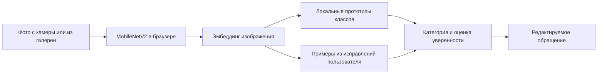

<div align="center">
  
  <h1>QalaFix AI</h1>
  <p><strong>Кішкентай мәселелер. Үлкен өзгеріс. Бір фото жеткілікті.</strong></p>
  <p>Мобильный Smart City MVP для Шымкента: фотография превращается в понятное городское обращение.</p>

  <p>
    <a href="https://nurbolidze121212.github.io/qalafix-ai-shymkent/"><strong>Открыть приложение</strong></a>
    · <a href="https://qalafix-ai-shymkent.bibliotekacaiu.chatgpt.site">Резервная версия</a>
    · <a href="data/ai-evaluation.json">Результаты AI</a>
  </p>

  <p>
    
    
    
    
    
  </p>
</div>



## Зачем нужен QalaFix AI

Открытый люк, яма, утечка воды, сломанная скамейка или мусор кажутся небольшими проблемами. Но жителю часто непонятно, куда обращаться, как описать ситуацию и как затем отследить заявку. QalaFix AI сокращает этот путь до одного понятного сценария:

**Фото → локальный AI-анализ → проверка адреса → отправка → карта → панель оператора.**

Главный демонстрационный сценарий — мусор. Остальные категории показывают, что архитектура масштабируется на другие городские службы.

## Что уже работает

- отдельный запуск камеры и выбор изображения из галереи;
- локальное распознавание шести категорий без платного AI API;
- ручная проверка результата вместо ложной «100% уверенности»;
- адаптивное обучение на исправлениях пользователя — только на текущем устройстве;
- координаты телефона и определение ближайшего адреса улицы/дома;
- создание обращения, карта проблем и операторская панель;
- сохранение заявок и статусов после перезагрузки;
- PWA и нативная Android-сборка через Capacitor.

## Категории

| Класс модели | Результат в интерфейсе | Приоритет по умолчанию |
| --- | --- | --- |
| `trash` | Мусор | средний |
| `manhole` | Безопасность / ЖКХ | критический |
| `pothole` | Дороги | высокий |
| `water_leak` | Водоснабжение | высокий |
| `broken_bench` | Благоустройство | низкий |
| `other` | Другое / ручная проверка | средний |

## Как устроен AI



Фотография не отправляется во внешний AI-сервис. MobileNetV2 вычисляет числовой эмбеддинг на устройстве, а классификатор сравнивает его с локальными прототипами. Если пользователь исправляет результат локальной модели, эмбеддинг сохраняется в `localStorage` и участвует в следующих анализах на этом же устройстве. Хранится не более 12 пользовательских примеров на категорию.

Это персональная адаптация MVP, а не глобальное переобучение общей модели. Очистка данных браузера удалит эти примеры.

## Данные и честная оценка

- 176 обучающих примеров: 140 основных и 36 training-only дополнений;
- 30 validation-изображений;
- 30 отдельных final-test изображений;
- результат контролируемого final test: **29/30 категорий**;
- мусор: **24/25**, чистые сцены: **5/5**;
- отдельная регрессия четырёх дополнительных категорий: **4/4**.

Полные результаты находятся в [`data/ai-evaluation.json`](data/ai-evaluation.json), а происхождение и ограничения данных — в [`data/ai-source/README.md`](data/ai-source/README.md). Это результаты подготовленного тестового набора, а не обещание такой же точности на любой фотографии с телефона.

Повторная подготовка модели:

```bash
npm run prepare:ai
npm run train:ai
```

## Геолокация и приватность

Разрешение на геолокацию запрашивается только после явного нажатия пользователя. Координаты используются для отметки на карте. Для преобразования координат в ближайший адрес выполняется один запрос к Nominatim / OpenStreetMap; ответы кэшируются на 30 дней, а частота запросов ограничена правилами публичного сервиса.

Reverse geocoding возвращает ближайший подходящий объект OpenStreetMap, поэтому номер дома иногда требует ручной проверки. Документация: [Nominatim Reverse API](https://nominatim.org/release-docs/latest/api/Reverse/) и [Usage Policy](https://operations.osmfoundation.org/policies/nominatim/).

## Локальный запуск

Требования: Node.js 20+ и npm.

```bash
git clone https://github.com/nurbolidze121212/qalafix-ai-shymkent.git
cd qalafix-ai-shymkent
npm install
npm run dev
```

Проверка перед публикацией:

```bash
npm test
npm run lint
npm run build
```

Android APK:

```powershell
npm run android:apk
```

## Структура приложения

| Маршрут | Назначение |
| --- | --- |
| `/` | идея проекта и главный призыв |
| `/report` | камера, галерея, AI-анализ, адрес и отправка |
| `/map` | карта обращений с фокусом на мусор |
| `/dashboard` | показатели, фильтры и статусы оператора |

Основной код находится в `src/`, локальные AI-прототипы — в `public/ai/`, проверочные данные — в `data/`, Android-проект — в `android/`.

## Границы MVP

Сейчас обращения и пользовательские обучающие примеры хранятся локально в браузере/приложении. Backend, авторизация, общая городская база, модерация обучающих данных и интеграция с 109 — следующий этап. При низкой уверенности пользователь должен проверить категорию: QalaFix AI не подменяет неопределённость выдуманной точностью.
